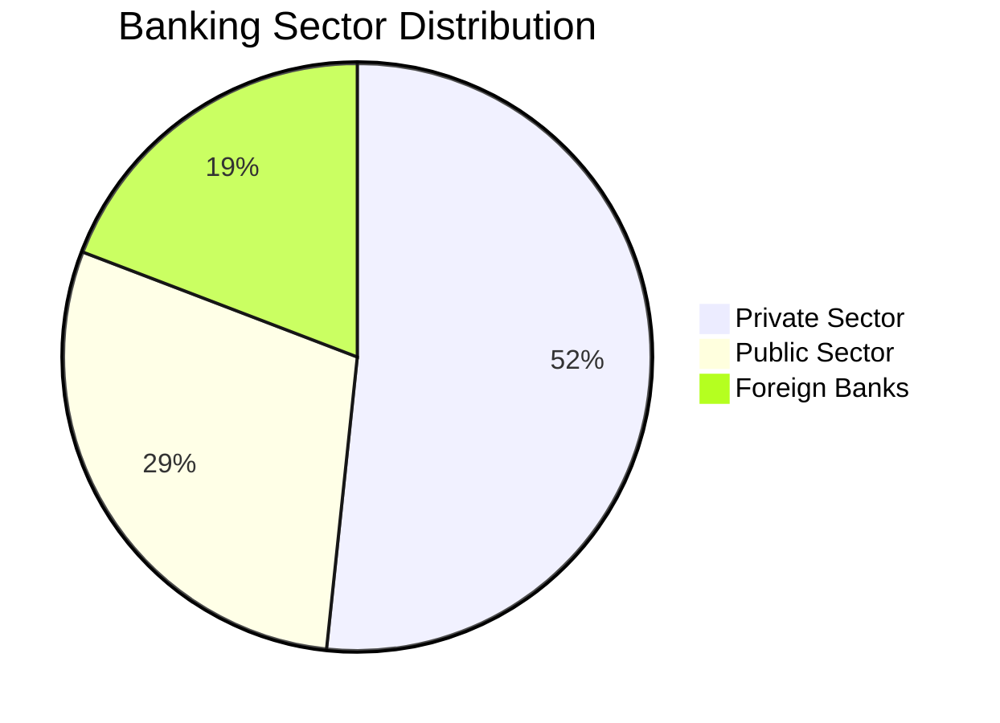

# 💳 Credit Card Market Performance Dashboard
### *Advanced Analytics & Business Intelligence Solution*

<div align="center">


[](https://powerbi.microsoft.com/)
[](https://docs.microsoft.com/en-us/dax/)
[](https://www.microsoft.com/excel)
[](#)

</div>

---

## 🎯 Project Overview

> **Transforming raw financial data into actionable business intelligence**

This sophisticated Power BI dashboard delivers comprehensive insights into credit card market dynamics, enabling data-driven decision making through interactive visualizations and advanced analytics across the Indian banking ecosystem.

<details>
<summary>🔗 <strong>Quick Access Links</strong></summary>

- 📊 [Live Dashboard](https://github.com/Rishabhjaiswal045/Indian_credit_market)
- 📄 [Documentation](https://github.com/Rishabhjaiswal045/Indian_credit_market/wiki)
- 🔧 [Technical Guide](https://github.com/Rishabhjaiswal045/Indian_credit_market/blob/main/TECHNICAL.md)

</details>

---

## ✨ Core Features & Capabilities

<table>
<tr>
<td width="50%">

### 📊 **Real-Time Analytics**
- Dynamic KPI monitoring
- Live data refresh capabilities
- Automated alert systems
- Performance tracking dashboards

### 🏦 **Multi-Sector Intelligence** 
- Public sector analysis
- Private banking insights
- Foreign bank performance
- Comparative sector studies

</td>
<td width="50%">

### 🗺️ **Geographic Intelligence**
- Interactive city-wise mapping
- Regional performance heatmaps
- Demographic analysis
- Location-based trends

### ⏱️ **Temporal Analysis**
- Time-series forecasting
- Seasonal trend identification
- Historical performance tracking
- Predictive modeling

</td>
</tr>
</table>

---

## 📈 Executive Summary Dashboard

```
┌─────────────────────────────────────────────────────────────┐
│                    KEY PERFORMANCE METRICS                  │
├─────────────────────────────────────────────────────────────┤
│  📋 Total Applications     │  5,599  │  📈 Growth Rate  19.28% │
│  ✅ Approved Applications  │    750  │  📊 Approval Rate 13.40% │
│  ❌ Rejected Applications  │  4,849  │  🎯 Success Ratio  1:7.5 │
└─────────────────────────────────────────────────────────────┘
```

<div align="center">

### 🏆 **Top Performing Markets**

| 🌟 **City** | 📊 **Approval Rate** | 🎯 **Performance** |
|-------------|---------------------|-------------------|
| Kota | 33.33% | 🥇 Market Leader |
| Connaught Place | 26.56% | 🥈 Strong Performance |
| Anantapur | 20.31% | 🥉 Above Average |

</div>

---

## 🔍 Market Intelligence Deep Dive

### 🏦 **Sector Performance Matrix**



### 💳 **Card Portfolio Analysis**

<div align="center">

| Card Type | Applications | Market Share | Status |
|-----------|-------------|--------------|---------|
| 🥇 **Gold** | 800 | 20% |  |
| 🔶 **Master** | 800 | 20% |  |
| 💎 **Platinum** | 800 | 20% |  |
| 🟦 **RuPay** | 800 | 20% |  |
| 🔵 **Visa** | 800 | 20% |  |

</div>

### 🤝 **Strategic Partnerships**

> **Co-Branding Performance Leaders**

- 🛒 **Amazon**: 464 applications (Market Dominator)
- 📱 **Airtel**: Strong telecommunications synergy
- 🛍️ **Flipkart**: E-commerce integration leader

---

## 🛠️ Technical Architecture

### 📊 **Advanced DAX Implementations**

<details>
<summary><strong>💡 Monthly Growth Rate Calculator</strong></summary>

```dax
Monthly_Growth = 
VAR CurrentMonth = [Total_Applications]
VAR PreviousMonth = 
    CALCULATE(
        [Total_Applications],
        DATEADD(Applications[Date], -1, MONTH)
    )
VAR GrowthPercentage = 
    DIVIDE(
        CurrentMonth - PreviousMonth, 
        PreviousMonth, 
        0
    )
RETURN 
    IF(
        ISBLANK(PreviousMonth), 
        0, 
        GrowthPercentage
    )
```

</details>

<details>
<summary><strong>🎯 Dynamic Approval Rate Engine</strong></summary>

```dax
Approval_Rate = 
DIVIDE(
    CALCULATE(
        COUNTROWS(Applications),
        Applications[Status] = "Approved"
    ),
    COUNTROWS(Applications),
    0
) * 100
```

</details>

<details>
<summary><strong>📈 Performance Trend Analyzer</strong></summary>

```dax
Trend_Analysis = 
VAR CurrentValue = [Total_Applications]
VAR PreviousValue = [Previous_Period_Applications]
VAR TrendDirection = 
    SWITCH(
        TRUE(),
        CurrentValue > PreviousValue, "↗️ Increasing",
        CurrentValue < PreviousValue, "↘️ Decreasing",
        "➡️ Stable"
    )
RETURN TrendDirection
```

</details>

---

## 💡 Strategic Insights & Discoveries

### 🎯 **Key Business Intelligence**

<table>
<tr>
<td width="33%">

#### 🏆 **Market Leadership**
- Private sector dominance
- 51.7% market share
- Aggressive growth strategy
- Digital transformation leader

</td>
<td width="33%">

#### 🌍 **Geographic Patterns**
- Tier-2 city outperformance
- Urban vs rural dynamics
- Regional policy variations
- Economic corridor trends

</td>
<td width="33%">

#### 📊 **Seasonal Dynamics**
- Q2 peak performance
- July adjustment period
- Lending criteria evolution
- Market cycle patterns

</td>
</tr>
</table>

### 🔮 **Future Roadmap**

- [ ] **Real-Time Integration** - Live data streaming implementation
- [ ] **AI/ML Models** - Predictive approval algorithms
- [ ] **Customer 360** - Comprehensive profiling system
- [ ] **Risk Analytics** - Advanced scoring mechanisms
- [ ] **Mobile Dashboard** - Responsive design optimization

---

## 🚀 Technology Stack

<div align="center">

### **Core Technologies**


### **Data Sources**


</div>

---

## 📱 Dashboard Gallery

<div align="center">

### 🎨 **Visual Showcase**

> *"Data visualization is the gateway to insight"*

| View | Description | Features |
|------|-------------|----------|
| 📊 **Executive Summary** | C-Suite dashboard | KPIs, Trends, Alerts |
| 🔍 **Detailed Analytics** | Operational insights | Drill-downs, Filters |
| 💰 **Profitability View** | Financial performance | ROI, Margins, Revenue |
| 🗺️ **Geographic Intelligence** | Location analysis | Maps, Regional data |

</div>

---

## 👨‍💼 About the Creator

<div align="center">

### **Rishabh Jaiswal** 
*Data Analyst & Business Intelligence Specialist*

[](https://github.com/Rishabhjaiswal045)
[](#)
[](#)
[](#)

*Transforming data into business value through innovative analytics solutions*

</div>

---

<div align="center">

### 🌟 **Project Stats**


---


**Made with 💖 and lots of ☕ | Powered by Power BI & DAX**

*© 2025 Rishabh Jaiswal | Data Analytics Portfolio*

</div>
